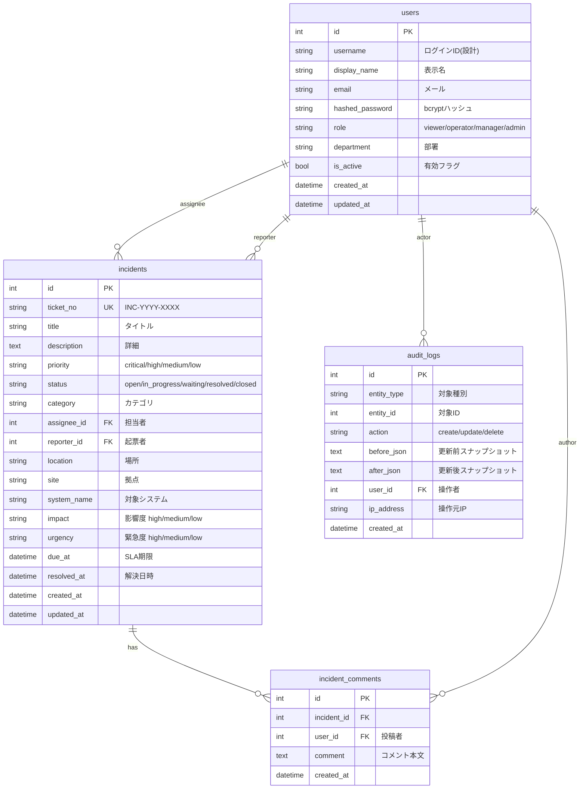

# データモデル設計書

**システム名**: ITSM Management / Service Desk
**文書番号**: ITSM-DMD-001
**ステータス**: ドラフト（実装開始前）

---

## 改訂履歴

| 日付 | 版 | 内容 | 担当 |
|------|-----|------|------|
| 2026-08-18 | 0.1 | 初版作成。既存実装（`backend/app/models/`）の精査結果に基づく | 開発チーム |

---

## 1. 概要

本設計書では、ITSM Management / Service Desk のデータベース設計を定義する。

- **DBMS**: SQLite（開発）→ PostgreSQL（本番、Phase 3）
- **ORM**: SQLAlchemy 2.0（`Mapped` / `mapped_column` スタイル）
- **規約**:
  - テーブル名はスネークケース・複数形（`incidents`, `incident_comments`）
  - 主キーは `id`（Integer, autoincrement, index付き）
  - タイムスタンプは `DateTime(timezone=True)` でUTC保存
  - 作成日時 `created_at` / 更新日時 `updated_at` は全テーブルに付与（AuditLog等の例外あり）

---

## 2. ER図



---

## 3. テーブル定義

### 3.1 users（ユーザー）

| カラム | 型 | 制約 | 説明 |
|--------|-----|------|------|
| id | Integer | PK, autoincrement, index | ユーザーID |
| username | String(50) | UNIQUE（設計） | ログインID |
| display_name | String(100) | NOT NULL | 表示名（例: 田中 太郎） |
| email | String(255) | UNIQUE | メールアドレス |
| hashed_password | String(255) | NOT NULL | bcryptハッシュ済みパスワード |
| role | String(20) | NOT NULL, default `viewer` | viewer / operator / manager / admin |
| department | String(100) | NULL | 部署 |
| is_active | Boolean | NOT NULL, default true | 有効フラグ（false は認証不可） |
| created_at | DateTime(tz) | NOT NULL | 作成日時 |
| updated_at | DateTime(tz) | NOT NULL | 更新日時 |

**サンプルデータ**（現行モック）:

| id | display_name | email | role | department |
|----|--------------|-------|------|------------|
| 1 | 田中 太郎 | tanaka@example.com | admin | IT管理課 |
| 2 | 佐藤 花子 | sato@example.com | operator | ヘルプデスク |
| 3 | 鈴木 一郎 | suzuki@example.com | operator | インフラ課 |
| 4 | 山田 美咲 | yamada@example.com | manager | IT管理課 |
| 5 | 高橋 健太 | takahashi@example.com | viewer | 総務部 |

### 3.2 incidents（インシデント）

| カラム | 型 | 制約 | 説明 |
|--------|-----|------|------|
| id | Integer | PK, index | インシデントID |
| ticket_no | String(20) | UNIQUE, index, NOT NULL | チケット番号（INC-YYYY-XXXX） |
| title | String(200) | NOT NULL | タイトル |
| description | Text | NULL | 詳細説明 |
| priority | String(20) | default `medium` | critical / high / medium / low |
| status | String(20) | default `open` | open / in_progress / waiting / resolved / closed |
| category | String(50) | NULL | カテゴリ（メール / ネットワーク / サーバ 等） |
| assignee_id | Integer | FK → users.id, NULL | 担当者 |
| reporter_id | Integer | FK → users.id, NULL | 起票者 |
| location | String(100) | NULL | 場所 |
| site | String(100) | NULL | 拠点（本社 / 現場A / 現場B / 全拠点） |
| system_name | String(100) | NULL | 対象システム（Microsoft 365 / VPN 等） |
| impact | String(20) | NULL | 影響度 high / medium / low |
| urgency | String(20) | NULL | 緊急度 high / medium / low |
| due_at | DateTime(tz) | NULL | SLA期限 |
| resolved_at | DateTime(tz) | NULL | 解決日時 |
| created_at | DateTime(tz) | NOT NULL | 作成日時 |
| updated_at | DateTime(tz) | NOT NULL | 更新日時 |

**リレーション**:

- `assignee` → users（担当者）
- `reporter` → users（起票者）
- `comments` → incident_comments（cascade: all, delete-orphan）

**ステータス遷移**:

```
open ──▶ in_progress ──▶ resolved ──▶ closed
   │          │            ▲
   │          └──▶ waiting ┘
   └──────────────────────▶ closed（直接クローズ）
```

**SLA状態（計算値・非保存）**: `sla_status`（safe / risk / urgent）はレスポンス時に計算。

### 3.3 incident_comments（インシデントコメント）

| カラム | 型 | 制約 | 説明 |
|--------|-----|------|------|
| id | Integer | PK, index | コメントID |
| incident_id | Integer | FK → incidents.id, index, NOT NULL | 対象インシデント |
| user_id | Integer | FK → users.id, NULL | 投稿者 |
| comment | Text | NOT NULL | コメント本文 |
| created_at | DateTime(tz) | NOT NULL | 投稿日時 |

### 3.4 audit_logs（監査ログ）

| カラム | 型 | 制約 | 説明 |
|--------|-----|------|------|
| id | Integer | PK, index | ログID |
| entity_type | String(50) | NOT NULL | 対象エンティティ種別（incident 等） |
| entity_id | Integer | NOT NULL, index | 対象レコードID |
| action | String(20) | NOT NULL | create / update / delete |
| before_json | Text | NULL | 更新前スナップショット（JSON文字列） |
| after_json | Text | NULL | 更新後スナップショット（JSON文字列） |
| user_id | Integer | FK → users.id, NULL | 操作者 |
| ip_address | String(45) | NULL | 操作元IP（IPv6対応） |
| created_at | DateTime(tz) | NOT NULL | 記録日時 |

**記録ルール**:

- create: after_json のみ（before は null）
- update: before_json + after_json の両方
- delete: before_json のみ（after は null）

---

## 4. Phase 2 追加テーブル（設計）

各モジュールのバックエンド実装時に追加する。以下は設計案であり、実装時に確定する。

### 4.1 problems（問題管理）

| カラム | 型 | 説明 |
|--------|-----|------|
| id | Integer PK | 問題ID |
| ticket_no | String(20) UK | 問題番号（PRB-YYYY-XXXX） |
| title | String(200) | タイトル |
| description | Text | 詳細 |
| status | String(20) | open / investigating / known_error / resolved / closed |
| priority | String(20) | critical / high / medium / low |
| root_cause | Text | 根本原因（RCA結果） |
| workaround | Text | 回避策 |
| related_incident_ids | JSON/Text | 関連インシデントID配列 |
| created_at / updated_at | DateTime(tz) | タイムスタンプ |

### 4.2 changes（変更管理）

| カラム | 型 | 説明 |
|--------|-----|------|
| id | Integer PK | 変更ID |
| ticket_no | String(20) UK | 変更番号（CHG-YYYY-XXXX） |
| title | String(200) | タイトル |
| change_type | String(20) | normal / standard / emergency |
| risk_level | String(20) | high / medium / low |
| status | String(20) | draft / review / approved / implementing / closed / rejected |
| scheduled_at | DateTime(tz) | 実施予定日時 |
| created_at / updated_at | DateTime(tz) | タイムスタンプ |

### 4.3 cmdb_items（CMDB）

| カラム | 型 | 説明 |
|--------|-----|------|
| id | Integer PK | CI ID |
| ci_id | String(20) UK | 構成ID（CI-YYYY-XXXX） |
| name | String(200) | CI名（AD-DC01 等） |
| ci_type | String(20) | server / network / software / service / storage / other |
| environment | String(20) | production / staging / cloud |
| site | String(100) | 拠点 |
| status | String(20) | active / maintenance / retired |
| owner | String(100) | オーナー部署 |
| created_at / updated_at | DateTime(tz) | タイムスタンプ |

### 4.4 knowledge_articles（ナレッジ管理）

| カラム | 型 | 説明 |
|--------|-----|------|
| id | Integer PK | 記事ID |
| ticket_no | String(20) UK | 記事番号（KA-YYYY-XXXX） |
| title | String(200) | タイトル |
| category | String(50) | FAQ / 障害対応手順 / 運用手順 / 現場向け手順 |
| body | Text | 本文 |
| status | String(20) | draft / review / published / archived |
| view_count | Integer | 参照数 |
| helpful_count | Integer | 「役立った」数 |
| created_at / updated_at | DateTime(tz) | タイムスタンプ |

### 4.5 assets（IT資産）

| カラム | 型 | 説明 |
|--------|-----|------|
| id | Integer PK | 資産ID |
| asset_no | String(20) UK | 資産番号（AST-YYYY-XXXX） |
| name | String(200) | 資産名 |
| asset_type | String(20) | pc / monitor / nas / printer / smartphone / ups |
| site | String(100) | 拠点 |
| status | String(20) | stock / in_use / maintenance / retired / disposed |
| assignee | String(100) | 利用者 |
| purchase_date | Date | 購入日 |
| warranty_end | Date | 保証期限 |
| created_at / updated_at | DateTime(tz) | タイムスタンプ |

### 4.6 patches（パッチ管理）

| カラム | 型 | 説明 |
|--------|-----|------|
| id | Integer PK | パッチID |
| patch_no | String(20) UK | パッチ番号（PTH-YYYY-XXXX） |
| title | String(200) | タイトル |
| severity | String(20) | critical / high / medium / low |
| patch_type | String(20) | windows_update / office / bios / vpn / antivirus / cad |
| status | String(20) | planned / testing / deploying / completed / failed / cancelled |
| target_count | Integer | 対象台数 |
| applied_count | Integer | 適用台数 |
| scheduled_at | DateTime(tz) | 展開期限 |
| created_at / updated_at | DateTime(tz) | タイムスタンプ |

### 4.7 security_events（セキュリティ管理）

| カラム | 型 | 説明 |
|--------|-----|------|
| id | Integer PK | イベントID |
| event_no | String(20) UK | イベント番号（SEC-YYYY-XXXX） |
| title | String(200) | 内容 |
| event_type | String(30) | suspicious_login / usb_block / mfa_failure / dlp / vpn_failure / unauthorized_access |
| severity | String(20) | critical / high / medium / low |
| status | String(20) | detected / investigating / contained / resolved / closed |
| target | String(200) | 対象（user: 〜 / PC: 〜 等） |
| action_taken | Text | 対応内容 |
| created_at / updated_at | DateTime(tz) | タイムスタンプ |

### 4.8 service_requests（サービス要求）

| カラム | 型 | 説明 |
|--------|-----|------|
| id | Integer PK | 申請ID |
| req_no | String(20) UK | 申請番号（REQ-YYYY-XXXX） |
| title | String(200) | 申請内容 |
| category | String(20) | pc / account / teams / permission / software |
| requester | String(100) | 申請者名 |
| priority | String(20) | high / medium / low |
| status | String(20) | pending / approving / in_progress / completed / rejected / cancelled |
| approver | String(100) | 承認者名 |
| created_at / updated_at | DateTime(tz) | タイムスタンプ |

---

## 5. マスタデータ

### 5.1 拠点（site）

| 値 | 説明 |
|-----|------|
| 本社 | 本社 |
| 現場A | 現場A |
| 現場B | 現場B |
| 全拠点 | 全拠点（共通） |

### 5.2 カテゴリ（incidents.category）

| 値 | 説明 |
|-----|------|
| メール | メール関連 |
| ネットワーク | ネットワーク関連 |
| サーバ | サーバ関連 |
| プリンタ | プリンタ関連 |
| PC | PC関連 |
| ソフトウェア | ソフトウェア関連 |
| クラウド | クラウドサービス |
| コミュニケーション | コミュニケーションツール |
| 認証 | 認証・ID |
| 業務システム | 業務システム |
| セキュリティ | セキュリティ関連 |
| AV機器 | AV機器関連 |

---

## 6. インデックス設計

| テーブル | インデックス | 目的 |
|----------|--------------|------|
| incidents | (ticket_no) UNIQUE | チケット番号検索 |
| incidents | (status) | ステータス絞り込み |
| incidents | (assignee_id) | 担当者別一覧 |
| incidents | (created_at DESC) | 一覧の新着順 |
| incident_comments | (incident_id) | インシデント別コメント取得 |
| audit_logs | (entity_type, entity_id) | 対象レコードの監査履歴 |
| users | (email) UNIQUE | ログイン・メール検索 |

---

## 7. データ保存・削除方針

| 項目 | 方針 |
|------|------|
| 監査ログ | 削除禁止。参照のみ許可 |
| インシデント | 論理削除ではなく物理削除だが、監査ログで復元可能（Phase 3で論理削除検討） |
| パスワード | bcryptハッシュのみ保存。平文・復元可能な暗号化は禁止 |
| バックアップ | 日次フルバックアップ（DB）+ 監査ログ長期保存 |
