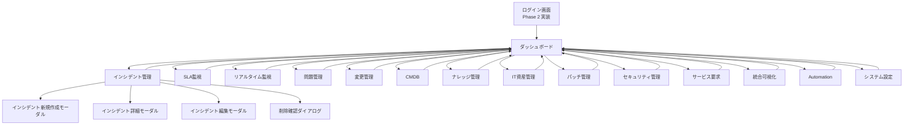

# 画面設計書

**システム名**: ITSM Management / Service Desk
**文書番号**: ITSM-SCR-001
**ステータス**: ドラフト（実装開始前）

---

## 改訂履歴

| 日付 | 版 | 内容 | 担当 |
|------|-----|------|------|
| 2026-08-18 | 0.1 | 初版作成。既存実装（`index.html`）の精査結果に基づく | 開発チーム |

---

## 1. 概要

本設計書では、ITSM Management / Service Desk の全画面のレイアウト・UI仕様・画面遷移を定義する。

- **現行実装**: `index.html`（React SPA・単一HTML）
- **画面構成**: サイドバー＋ヘッダー＋コンテンツ領域の3ペイン構造
- **レスポンシブ**: デスクトップWeb前提（1280×800以上推奨）。900px以下でグリッドが1カラム化

---

## 2. 全体レイアウト

```
┌──────────┬──────────────────────────────────────────────┐
│          │  Header（タイトル・パンくず・テーマ切替・通知） │
│ Sidebar  ├──────────────────────────────────────────────┤
│ ロゴ     │                                              │
│ 検索     │            Content（画面切替）                │
│ ナビ     │                                              │
│ フッター  │                                              │
│ ユーザー  │                                              │
└──────────┴──────────────────────────────────────────────┘
```

### 2.1 サイドバー（248px / 折りたたみ時64px）

| 要素 | 内容 |
|------|------|
| ロゴ | 「IT」マーク＋「ITSM Management / Service Desk」 |
| メニュー検索 | ナビ項目のあいまい検索 |
| セクション | 概要 / ITSM管理 / 分析・自動化（折りたたみ可） |
| ユーザー | アバター＋氏名＋ロール・部署 |
| フッター | システム設定ボタン |

### 2.2 ヘッダー（56px）

| 要素 | 内容 |
|------|------|
| 左 | サイドバー折りたたみボタン＋画面タイトル＋パンくず |
| 右 | テーマ切替（ライト/ダーク）＋通知ボタン（未読ドット付き） |

### 2.3 共通コンポーネント

| コンポーネント | 仕様 |
|----------------|------|
| KPIカード | アイコン＋ラベル＋値＋補足。ホバーでシャドウ上昇 |
| ピル（Pill） | ステータス・優先度表示。6トーン（success/danger/warning/info/neutral） |
| ボタン | primary / outline / ghost / danger × md / sm |
| モーダル | 最大幅640px（確認ダイアログ440px）。Esc・背景クリックで閉じる |
| テーブル | ソート可能ヘッダー・行ホバー・行クリックで詳細表示 |
| トースト | 右上に3.4秒表示。success/info/error の左ボーダー色分け |

---

## 3. 画面遷移図



> 現行はログイン画面なし（モック）。ヘッダー・サイドバーのユーザーは固定表示（田中 太郎 / admin）。

---

## 4. 画面別詳細

### 4.1 ダッシュボード（`dashboard`）

**画面構成（上から順）**:

1. **ページヘッダー**: タイトル「ダッシュボード」＋説明＋アクション（レポート出力 / 新規インシデント）
2. **KPI 5枚**: 総チケット数 / 未対応 / SLA違反 / SLA遵守率 / 平均解決時間
3. **グリッド2カラム（1.5:1）**:
   - 直近7日のインシデント推移（折れ線グラフ）
   - SLA遵守率（ドーナツチャート＋凡例）
4. **グリッド2カラム（1:1）**:
   - 優先度別の未解決分布（棒グラフ）
   - カテゴリ別インシデント（横棒+割合）
5. **拠点別の未解決インシデント**: カードグリッド。件数別の状態ピル（3件以上: 注意 / 2件以上: 警戒 / それ以外: 安定）

**データソース**: `MockAPI.getDashboardSummary()` ＋ モックデータの集計

### 4.2 インシデント管理（`incidents`）

**画面構成**:

1. ページヘッダー＋アクション（新規作成 / CSV）
2. KPI 3枚: 総チケット / 未対応 / SLA違反
3. フィルタバー: 検索ボックス＋ステータス/優先度/拠点セレクト＋クリアボタン
4. テーブル: チケット番号 / タイトル / 優先度 / ステータス / SLA / 拠点 / 作成日 / 操作（編集・削除）
5. ページネーション: 全件数表示＋前へ/次へ/ページ番号

**SLAピル表示**:

| 状態 | 表示 | 条件 |
|------|------|------|
| 安全 | 緑ピル「安全」 | 期限まで2時間以上 |
| 注意 | 黄ピル「注意」 | 期限まで2時間以内 |
| 超過 | 赤ピル「超過」 | 期限超過（未解決） |
| 遵守 | 緑「解決済」ピル | 解決日時 ≤ 期限 |
| 違反 | 赤「緊急」ピル | 解決日時 > 期限 |

**新規作成モーダル**（フォーム項目）:

| 項目 | 型 | 必須 | 初期値 |
|------|-----|------|--------|
| タイトル | text | ✅ | — |
| 優先度 | select | ✅ | medium |
| ステータス | select | — | open |
| カテゴリ | text | — | — |
| 拠点 | select | — | 本社 |
| 対象システム | text | — | — |
| 詳細 | textarea | — | — |

**詳細モーダル**: 全フィールドを定義リスト表示（ステータス・優先度はピル表示、日付は整形）

### 4.3 SLA監視（`sla`）

1. KPI 4枚: SLA遵守率 / 期限超過 / リスク（2h以内）/ 平均解決時間
2. SLAリスク一覧テーブル: チケット / タイトル / 優先度 / SLA / 期限
   - 表示対象: 期限超過＋リスクチケット（未解決のみ）

### 4.4 リアルタイム監視（`realtime`）

- カードグリッド（auto-fill, min 300px）
- 各カード: パルスドット＋システム名＋レイテンシ/稼働率＋状態ピル
- 5秒ごとに自動更新（ヘッダーに「自動更新中・最終更新時刻」表示）
- 監視対象: Microsoft 365 / VPN Gateway / Active Directory / ファイルサーバ / メールサーバ / CADライセンスサーバ / プリントサーバ / 監視（Zabbix）

### 4.5 問題管理（`problem`）

- KPI 3枚: 未解決問題 / 既知エラー / 総登録数
- テーブル: 問題番号 / タイトル / ステータス / 優先度 / 回避策 / 作成日
- フォーム: タイトル / 優先度 / ステータス / 根本原因 / 回避策

### 4.6 変更管理（`change`）

- KPI 3枚: 変更総数 / 承認待ち / 実施中
- テーブル: 変更番号 / タイトル / 種別 / リスク / ステータス / 実施予定
- フォーム: タイトル / 変更種別 / リスクレベル / ステータス / 実施予定日

### 4.7 CMDB（`cmdb`）

- KPI 3枚: 登録CI / サーバ・NW / アクティブ
- テーブル: CI ID / 名前 / 種別 / 環境 / 拠点 / 状態
- フォーム: 名前 / 種別 / 環境 / 拠点 / オーナー / 状態

### 4.8 ナレッジ管理（`knowledge`）

- KPI 3枚: 公開記事 / 総参照数 / レビュー待ち
- テーブル: 記事番号 / タイトル / カテゴリ / ステータス / 参照数 / 役立った
- フォーム: タイトル / カテゴリ / ステータス

### 4.9 IT資産管理（`asset`）

- KPI 3枚: 管理資産 / 使用中 / 保守中
- テーブル: 資産番号 / 名称 / 種別 / 拠点 / 利用者 / 状態
- フォーム: 名称 / 種別 / 拠点 / 利用者 / 状態

### 4.10 パッチ管理（`patch`）

- KPI 3枚: パッチ展開 / 適用率 / 緊急未完了
- テーブル: パッチ番号 / タイトル / 重要度 / 状態 / 適用/対象 / 期限
- フォーム: タイトル / 重要度 / 種別 / 状態 / 対象台数

### 4.11 セキュリティ管理（`security`）

- KPI 3枚: 重要アラート / 調査中 / イベント総数
- テーブル: イベント番号 / 内容 / 種別 / 重要度 / 状態 / 対象
- フォーム: 内容 / 種別 / 重要度 / 状態 / 対象 / 対応内容

### 4.12 サービス要求（`request`）

- KPI 3枚: 未処理 / 承認待ち / 完了
- テーブル: 申請番号 / 申請内容 / カテゴリ / 申請者 / 状態 / 申請日
- フォーム: 申請内容 / カテゴリ / 優先度 / 申請者

### 4.13 統合可視化（`visualization`）

- KPI 3枚: 可視化マップ / 影響サービス / 未紐付けCI
- テーブル: マップ名 / 対象 / 更新元 / 鮮度（最新/要更新/作成中）
- デモデータのみ（Phase 3でCMDB依存関係から実生成）

### 4.14 Automation / AIOps（`automation`）

- KPI 3枚: 自動化ルール / 自動チケット化 / 手作業削減
- テーブル: ルール名 / トリガー / 動作 / 状態（有効/無効）
- ルール例: SLA期限30分前通知 / VPN失敗検知 / 印刷キュー自動復旧 / ディスク容量警告 / サービス自動再起動

### 4.15 システム設定（`system-settings`）

| セクション | 項目 |
|------------|------|
| 表示設定 | ダークモード ON/OFF |
| SLA設定 | 緊急2h / 高4h / 中8h / 低24h / 営業時間09:00-18:00（表示） |
| 通知設定 | メール通知 / Teams通知 / 承認待ち通知（デモトグル） |
| データ管理 | フィルター初期化 / 設定エクスポート / サンプルデータリセット |
| ユーザー・ロール管理 | ユーザー一覧（氏名/メール/ロール/部署）＋編集ボタン（デモ） |

---

## 5. アクセシビリティ

### 5.1 現状（実装済み）

| 項目 | 対応 |
|------|------|
| キーボード | Escでモーダル/ダイアログを閉じる |
| フォーカス | `:focus-visible` でアクセント色のフォーカスリング |
| モーダル | `role="dialog"` `aria-modal="true"` `aria-label` |
| アイコン | `aria-hidden="true"`（装飾SVG） |
| テーブル | `aria-sort` 属性（ソート時） |
| トースト | `aria-live="polite"` |
| ナビ | `role="navigation"` `aria-current="page"` |

### 5.2 課題（Phase 1で最低限対応）

- フォーム入力の `label` と `for` 関連付けの明示
- テキストと背景のコントラスト比担保（4.5:1 / 3:1）
- インタラクティブ要素の操作名（`aria-label`）補完
- フォーカストラップ（モーダル表示中のタブ移動制御）

---

## 6. テーマ・デザイントークン

### 6.1 現行 `index.html`（oklchベース）

| トークン | ライト | ダーク |
|----------|--------|--------|
| --bg | oklch(97.5% 0.004 250) | oklch(19% 0.015 240) |
| --surface | oklch(100% 0 0) | oklch(23% 0.015 240) |
| --fg | oklch(24% 0.02 240) | oklch(95% 0.004 240) |
| --accent | oklch(55% 0.15 145) | oklch(72% 0.15 145) |
| --border | oklch(90.5% 0.008 240) | oklch(33% 0.016 240) |

- フォント: `Noto Sans JP`（本文）/ `JetBrains Mono`（数値・コード）
- アクセント: グリーン系（tech-utility / Datadog-GitHub 方向）

### 6.2 次期 `v2/` トークン（移行先）

- プライマリ: `--c-primary-600: #2563EB`（ブルー系）
- サイズ体系: `--fs-xs` 〜 `--fs-3xl` / `--sp-1` 〜 `--sp-12`
- シャドウ: `--shadow-xs` 〜 `--shadow-xl`

> Phase 2 で `v2/design-tokens.css` のトークン体系に統一し、oklch→CSS変数へ段階移行する。

---

## 7. 画面表示の注意事項

1. 数値は `JetBrains Mono` + `tabular-nums` で表示（桁揃え）
2. 日時は `YYYY/MM/DD HH:mm` 形式（短縮時 `MM/DD HH:mm`）
3. データ0件時は空状態（アイコン＋メッセージ）を表示
4. ローディング中はスケルトン（シマーアニメーション）を表示
5. 削除は必ず確認ダイアログを挟む
